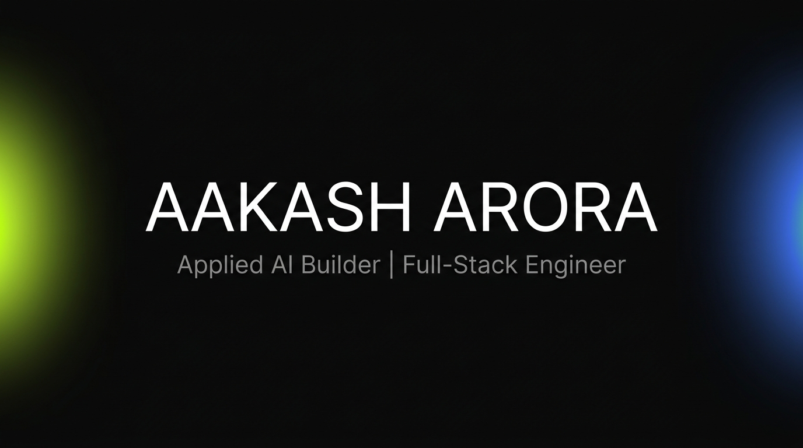

<p align="center">
  
</p>

<h3 align="center">Applied AI Builder | Full-Stack Engineer | MBA (AI) Candidate</h3>

<p align="center">
  <a href="https://dezinn.com"></a>
  <a href="https://linkedin.com/in/aakasharora6"></a>
</p>

---

### About Me

I build AI-powered products from zero to production. My work sits at the intersection of **applied AI engineering**, **premium UI/UX**, and **commercial strategy**. Currently completing an MBA with AI at Cardiff Business School while shipping real products for real clients.

I don't build demos. I build products that generate revenue.

---

### What I Build

| Project | Description | Stack |
|---------|-------------|-------|
| **[Empirisys Intelligence Hub](https://github.com/aakasharora15/empirisys-intelligence-hub)** | AI-powered competitor intelligence platform for a B2B SaaS company. Real client delivery. | Next.js, TypeScript, Supabase, Anthropic SDK, pgvector |
| **[AVA (Crucible)](https://github.com/aakasharora15/ava-venture-audit)** | Adversarial venture-audit engine. Stress-tests startups using the Crucible framework. | Next.js, React, Framer Motion, Claude API |
| **[CLUTCH Quotient](https://github.com/aakasharora15/clutch-quotient)** | AI + Computer Vision tennis coaching platform. YOLOv10 + BlazePose + pressure-performance scoring. | Python, YOLOv10, FastAPI, Next.js, ElevenLabs |
| **[TimedWell](https://github.com/aakasharora15/timedwell)** | Voice-first personal productivity SaaS with AI coaching. | Next.js, Whisper, ElevenLabs, Supabase |

---

### Tech Stack

<p align="center">
  
  
  
  
  
  
  
  
  
  
  
  
</p>

---

### Philosophy

```
Build with intent. Ship with taste. Never settle for "good enough."
```
